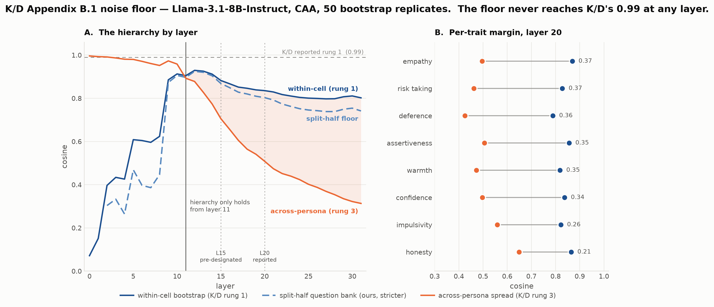
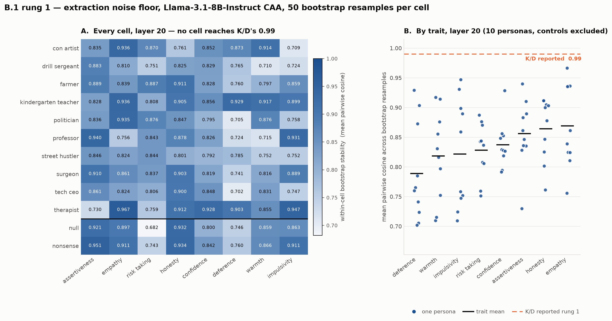
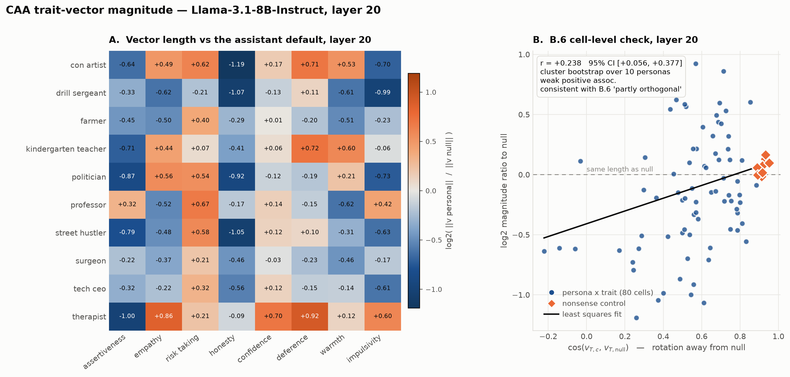

# K/D Appendix B.1 on Llama-3.1-8B — bootstrap noise floor

**Date:** 2026-08-10 · **Model:** `meta-llama/Llama-3.1-8B-Instruct` · **Method:** CAA
**Inputs:** `caa_activations/` (192 files, M=500 pairs/cell) for §1–6 and §9;
`caa_activations_paraphrase/` (800 files, 5 prompt variants × 10 personas) for §7–8
**Outputs:** `analysis/` — `caa_within_cell_stability.json`, `caa_variance_decomposition.json`,
`caa_magnitude.json`, `b1_noise_floor.{png,pdf}`, `b1_bootstrap_stability_L{15,20}.{png,pdf}`,
`magnitude_L{15,20,25}.{png,pdf}`
**Code:** `scripts/caa_within_cell_stability.py`, `scripts/caa_variance_decomposition.py`,
`scripts/caa_magnitude.py`, and the three `plot_*` scripts alongside them

§1–6 and §9 are CPU-only re-analysis of activations already on disk — no GPU, minutes.
§7–8 required a GPU re-extraction: the paraphrase arm did not exist, because every prior
run used `system_prompt_variants[0]` only (~50 min on an RTX PRO 6000, 640 new files, 79GB).

---

## Why this exists separately from `caa_cosine_to_null.py`

Both scripts compute "a noise floor", and they are **not the same estimator**. Quoting one
against K/D's number is a category error, and that was the first thing to fix.

- `caa_cosine_to_null.py` computes NULL-vs-NULL under two *independent* resamples. That is
  the correct floor for the statistic it accompanies (a persona-vs-null cosine), and its
  unpaired construction is deliberate — see the docstring at lines 19–24.
- K/D's B.1 rung 1 is **pairwise cosine among B bootstrap replicates of one cell**. Different
  estimand, different construction (resampling is *paired* — the contrastive pair is the
  sampling unit).

`caa_within_cell_stability.py` computes K/D's version, plus two floors they do not.

### The gating question: are the per-pair deltas recoverable?

Yes. The pipeline caches **per-question** activations, not the averaged trait vector.
`{persona}_{trait}_{pos,neg}.pt` are dicts of 500 question-keyed `[32, 4096]` fp16 tensors,
and pos/neg carry **identical keys in identical order**, so `delta[q] = pos[q] - neg[q]` is
exact. The `[M, d_model]` per-cell array that the bootstrap needs already exists on disk;
nothing needed re-extracting. Storage for an explicit delta cache would be ~12.6 GB at all
layers, but it is redundant — the 24 GB of raw activations already is the cache.

---

## Results

Persona-averaged (excludes `null` and `nonsense`), averaged over all 8 traits.

| layer | rung 1 (within-cell) | split-half (SB) | rung 3 (across-persona) | margin (r1 − r3) |
|---|---|---|---|---|
| 10 | 0.913 | 0.906 | 0.958 | **−0.046** |
| 12 | **0.929** | 0.925 | 0.878 | 0.051 |
| 15 | 0.882 | 0.869 | 0.705 | 0.177 |
| 17 | 0.852 | 0.828 | 0.605 | 0.247 |
| 20 | 0.835 | 0.803 | 0.508 | 0.327 |
| 25 | 0.801 | 0.746 | 0.402 | 0.399 |
| 31 | 0.802 | 0.741 | 0.313 | 0.489 |





### 1. K/D's 0.99 does not reproduce — anywhere

Within-cell stability **peaks at 0.929 (layer 12)** and is 0.882 at L15, 0.835 at L20. It
never approaches 0.99 at any layer, despite M=500 pairs against K/D's M=100. The extraction
noise floor on Llama-3.1-8B is materially worse than the number the paper reports.

This is the single most consequential number here: any argument that inherits "extraction is
essentially noiseless, so spread is signal" from K/D is not licensed on this model.

### 2. The hierarchy survives, compressed, and only above layer 11

Rung 1 > rung 3 holds **from layer 11 onward**. Below that the ordering inverts — at layer 10
the across-persona cosine (0.958) sits *above* the floor (0.913), i.e. personas are not
distinguishable from resampling noise in the early stack. The margin then grows monotonically
with depth: 0.177 at L15, 0.327 at L20, 0.489 at L31.

So the qualitative K/D claim reproduces. What changed is the margin, and it is now measured
with their estimator rather than assumed comparable to ours.

### 3. Question-set variance is real and the bootstrap cannot see it

`split_half` is below `boot_half` at **every trait and every layer**. Size-matched at 250
pairs, the gap attributable purely to *disjointness* is **0.025 at L15 and 0.047 at L20**.
Projected back to the full bank (Spearman-Brown), the bootstrap floor is optimistic by
**0.014 at L15 and 0.033 at L20**.

Modest, systematic, and in the wrong direction for a programme whose claims are about
dispersion. The bootstrap resamples the M pairs you have; the split-half varies which
questions you asked.

### 4. The currently-published floor is under-resolved

At `n_boot=50` the floor estimate swings **0.886–0.908 at L15 on the choice of seed alone**.
The value in `caa_cosine_to_null.json` is 0.9042 — the top of that range; a 400-draw estimate
converges to ~0.892. That line is drawn on the published figures. Not wrong, but it should be
re-run with more replicates before it carries any weight in the writeup.

### 5. Root cause is low SNR, not outlier questions

`||mean delta|| / mean||delta||` at L20 is **0.081** (politician) against **0.152** (null).
Per-pair norms are tight (max/median = 1.1), so this is not a handful of pathological
questions. A one-parameter SNR model predicts a split-half cosine of 0.62 against 0.61
observed, so the whole picture is internally consistent: the coherent trait signal is a small
fraction of a typical contrastive pair's magnitude, and personas have vectors that are both
**rotated and weaker** than null's.

That last point bears directly on B.6's "magnitude and direction decouple" claim — here they
do not look independent.

### 6. Layer selection: B.1 alone would pick a useless layer

Bootstrap stability peaks at L12, but at L12 the margin is only 0.051 — there is almost no
fan-out to measure. Stability and separation pull in opposite directions, so B.1 stability
cannot be used as a standalone layer criterion the way K/D's A.2 implies.

Taken together the two criteria **support the existing L20 choice over the pre-designated
L15**: L20 retains a workable floor (0.835) while nearly doubling the margin (0.327 vs 0.177).
That is an independent justification for a deviation `llama31_8b_stage1.md:241` had recorded
on fan-width grounds alone.

**Caveat, from the paper itself.** K/D §A.2 pick layer 22 on two criteria: (i) behavioral lift
under *self-steering* is among the largest in their sweep, and (ii) within-cell bootstrap
stability is high. We have measured (ii) but **not (i) — no steering has been run on Llama at
all.** So our layer choice rests on stability plus fan width, and fan width is not one of their
criteria. Matching their procedure properly would require a steering sweep.

---

### 7. Rung 2 — rephrasing the persona barely moves the vector

The paraphrase arm (5 `system_prompt_variants` per persona, 800 files) was extracted
2026-08-10, so the middle rung is now measured on our own model rather than inherited.
Persona-averaged, all 8 traits:

| | layer 15 | layer 20 |
|---|---|---|
| rung 1 — resample the questions | 0.882 | 0.835 |
| **rung 2 — reword the persona prompt** | **0.900** | **0.821** |
| rung 3 — change the persona | 0.705 | 0.508 |


K/D's own hierarchy (§B.1) is **0.99 within-cell > 0.85 across-paraphrase > 0.78
across-persona** — a clean descending ladder. Ours is shaped differently:

**Rung 2 sits on top of rung 1, not between rungs 1 and 3.** At layer 15 rewording the prompt
perturbs the trait vector *less* than resampling the questions does. The hierarchy is
**rung 1 ≈ rung 2 ≫ rung 3**, which is exactly the "identity, not phrasing" claim — now
demonstrated here rather than assumed from K/D.

Note the difference in shape. In K/D's data phrasing costs a visible 0.14 (0.99 → 0.85); in
ours it costs nothing measurable. That is not because our personas are more phrasing-robust
than theirs — it is because our rung-1 floor is so much lower that any paraphrase effect of
their size would be buried in it. Same conclusion, different regime, and worth saying plainly
rather than claiming a stronger result than we have.

### 8. Variance decomposition — ~2/3 of the spread is identity

Nested random-effects partition (`scripts/caa_variance_decomposition.py`) of trait-vector
direction into question-sampling error, across-paraphrase and across-persona components, on
the 2(1−cos) scale, with a cluster bootstrap over personas:

| | layer 15 | layer 20 |
|---|---|---|
| σ²_e (question sampling) | 0.10 – 0.15 | 0.13 – 0.21 |
| σ²_r (paraphrase) | **−0.04 to +0.03** | **−0.04 to +0.11** |
| σ²_p (persona) | 0.14 – 0.33 | 0.25 – 0.56 |
| **ICC_persona** | **0.55 – 0.69** | **0.63 – 0.72** |

At layer 15 **six of eight traits have a negative paraphrase component** — the observed
spread across rewordings is smaller than question-sampling error alone, so that level is
not resolvable above the noise beneath it. Negative components are reported, not clipped.

The one exception is **empathy at L20**, σ²_r = 0.110 against σ²_e = 0.125 — the only cell
where phrasing is comparable to noise rather than lost in it.

**Caveat on pooling.** `S_r` is computed per persona then averaged, so a single
phrasing-sensitive persona is invisible in the trait-level number. Individual cells vary a
lot (politician's warmth rotates far more under rewording than farmer's). "The average
persona is phrasing-insensitive" is supported; "every persona is" is not tested by this
statistic. A per-persona σ²_r would settle it and needs no new extraction.

### 9. Magnitude, and the B.6 decoupling test

`scripts/caa_magnitude.py` → `caa_magnitude.json`, `magnitude_L{15,20,25}.{png,pdf}`.
Reported as log2(‖v_persona‖ / ‖v_null‖); 0 means "same length as the assistant default".

**Magnitude tracks persona semantics.** At layer 25 the four deceptive personas collapse the
honesty vector to roughly 40% of its default length — con artist −1.42, street hustler −1.34,
drill sergeant −1.27, politician −1.19 — while the therapist *doubles* empathy (+1.05) and
lengthens deference (+0.90). The **nonsense control sits at ≈0 everywhere** (max +0.16), so
this is driven by the persona's meaning, not by the mere presence of a system prompt.



**B.6's cell-level claim reproduces; its trait-level claim does not transfer.**

Read the paper carefully before testing this: B.6 does **not** claim zero correlation. It says
magnitude and directional spread "are positively correlated at the trait level (deference,
warmth, and assertiveness appear in the upper tier of both)" but "do not agree cell-for-cell",
concluding that persona conditioning acts "along partly orthogonal axes". So the prediction is
a *weak positive* association, not a shapeless cloud. Correlating cosine-to-null against log2
magnitude ratio over all 80 persona×trait cells:

| layer | Pearson r | 95% CI (cluster bootstrap over personas) |
|---|---|---|
| 15 | +0.325 | [+0.138, +0.444] |
| 20 | +0.238 | [+0.056, +0.377] |
| 25 | +0.258 | [+0.108, +0.386] |

All three exclude zero even after clustering, which is the right test here since the 80 cells
share 10 personas and 8 traits and are not independent. r ≈ 0.25–0.33 is ~6–11% of variance —
a real but weak positive association, which is precisely what "partly orthogonal axes"
describes. **On the cell-level claim we agree with K/D.**

The *trait-level* half does not transfer. Correlating per-trait magnitude spread against
per-trait directional spread across the eight traits gives **+0.389 at L20 but only +0.095 at
L25** — weak and layer-unstable. And their named upper tier does not survive: on Llama, warmth
is upper-tier in both (rank 3 magnitude / 2 direction), but assertiveness is 1st in direction
and only 6th in magnitude, and deference is 7th in direction and 4th in magnitude, versus
K/D's report of all three in the upper tier of both on Gemma-2-27B.

**The layer-mismatch worry is empirically void.** K/D report magnitudes (Figure 7) at a
different layer from the cosine analysis, and reading two quantities at different depths could
in principle add noise. It does not: r at (cos 22, mag 25) is +0.275 against +0.269 for matched
(22, 22) and +0.258 for (25, 25). The fields are smooth enough across those layers that the
mismatch changes nothing, so it need not be raised as a confound.

**B.2 reproduces, cleanly.** §B.2 claims "switching the persona moves the vector's length by
about as much as switching the trait does". Comparing spreads of the same (trait × persona)
norm matrix — along personas with the trait held fixed, versus along traits with the persona
held fixed:

| layer | vary persona (range / SD) | vary trait (range / SD) | ratio (range / SD) |
|---|---|---|---|
| 15 | 0.665 / 0.212 | 0.627 / 0.212 | **1.06 / 1.00** |
| 20 | 1.438 / 0.489 | 1.260 / 0.437 | **1.14 / 1.12** |
| 25 | 2.561 / 0.889 | 2.453 / 0.855 | **1.04 / 1.04** |

Ratios sit at 1.0–1.14 on both measures at all three layers, so persona conditioning moves
trait-vector length by as much as changing the trait entirely does. This is the cleanest
replication of any K/D appendix claim we have tested. Stored as `b2_variance_comparison` in
`caa_magnitude.json`.

## Method notes and caveats

- **Spearman-Brown is a heuristic here.** SB is derived for correlations between parallel test
  halves; a cosine between two mean-difference vectors is not literally that. It is reported
  alongside the raw split-half, never instead of it.
- **SB is applied to the summary, not per replicate.** SB is concave, so per-replicate
  averaging understates it; and the split-half distribution has real mass below zero
  (politician at L20 runs [−0.14, 0.92]), so NaN-guarding per replicate silently drops the low
  tail and biases the result *up*. SB is monotone on r > −1, so transforming the summary
  quantiles is exact for lo/hi. The reported centre is SB(mean r), not mean SB(r).
- **Rung 1 and rung 3 are not the same estimand**, even though §1–6 put them in the same
  functional form (pairwise cosine over a set of vectors). That makes the comparison
  like-for-like but not a test; §8 is the test, since the decomposition estimates and
  subtracts σ²_e rather than comparing raw cosines computed different ways.
- **Do not derive rung 2 from the variance components.** The tempting identity
  cos = 1 − S_r assumes mean pairwise squared distance is twice the dispersion about a
  centroid. It fails here because `decompose()` normalises the persona mean to unit length
  and Bessel-corrects; a numerical check put the ratio at ~1.45 for n_r=5, not 2. Rung 2 is
  measured directly and stored as `across_paraphrase_cosine`.
- **Wide intervals are real.** Per-cell split-half 95% intervals routinely span 0.6+ of the
  range. That is the low-SNR regime, not an artifact.

## Two loose ends — outstanding, and they interact

**Loose end 1 — the published noise floor is under-resolved, and it gates the adapted-model
arm.** The floor in `caa_cosine_to_null.json` is an `n_boot=50` estimate whose seed-to-seed
scatter is ±0.01 (0.886–0.908 at L15 against a converged ~0.892), and it is the reference line
drawn on the published figures. Fixing it is a CPU-only re-run at `--n-boot 400`. This is not
cosmetic: a base-vs-adapted floor difference smaller than ~0.02 would be indistinguishable
from that scatter, so **this must be done before any adapted-model comparison** (see
fork-infra §13.4).

**Loose end 2 — no `nonsense` paraphrases.** The paraphrase arm covers the 10 personas only,
so there is no control answering "does a *meaningless* prompt also move under rephrasing?".
Compounded by fork-infra §7: the released `nonsense.yaml` is ~half the length of real personas
and is probably not the artifact behind K/D's figures, so it would need regenerating
length-matched before the control is worth much.

## Still out of scope for this document

- **The adapted model is unmeasured.** If a LoRA adapter shifts activation noise
  characteristics, apparent tightening under a constitution is confounded with a moving floor.
  Plan in fork-infra §13; blocked on loose end 1.
- **IV arm not started.** Everything here is CAA. Prereg Exp 0a asks for both.
- **Gemma-3-4B not provisioned.** Exp 0a covers both models.

## Reproduce

```bash
source /workspace/bootstrap.sh
python scripts/caa_within_cell_stability.py --model meta-llama/Llama-3.1-8B-Instruct \
    --n-boot 50 --n-splits 100 --report-layers 12 15 20
python scripts/plot_b1_noise_floor.py --model meta-llama/Llama-3.1-8B-Instruct --layer 20
python scripts/plot_b1_bootstrap_stability.py --model meta-llama/Llama-3.1-8B-Instruct --layer 20

# rung 2 + decomposition (needs the paraphrase arm, outputs/{model}/caa_activations_paraphrase/)
python scripts/caa_variance_decomposition.py --model meta-llama/Llama-3.1-8B-Instruct \
    --variants 0 1 2 3 4 --n-boot 50 --n-cluster 400

# magnitude + B.6
python scripts/caa_magnitude.py --model meta-llama/Llama-3.1-8B-Instruct --n-boot 200
python scripts/plot_magnitude.py --model meta-llama/Llama-3.1-8B-Instruct --layer 20
```

Needs only `numpy` + `torch` (+ `matplotlib` for the figure). No GPU.
