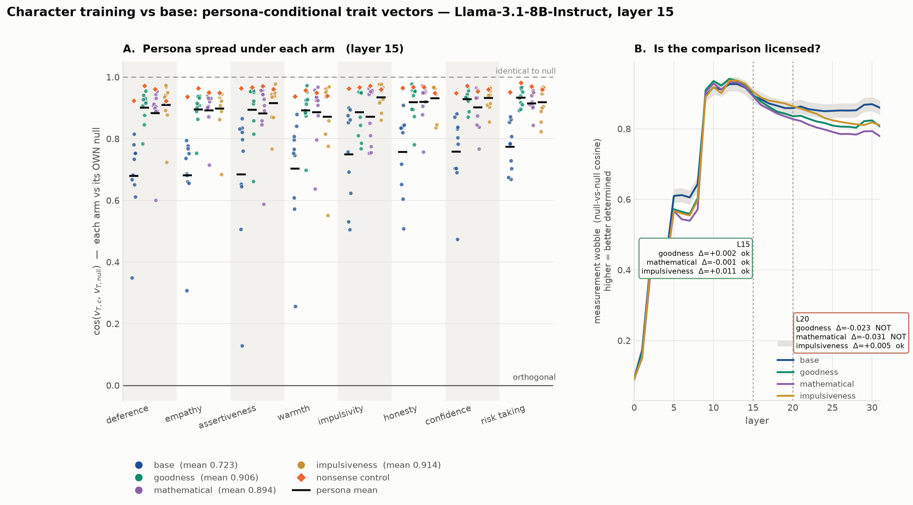

# Character-training arms on Llama-3.1-8B — `goodness`, `mathematical`, `impulsiveness`

**Status:** three arms complete. **The headline result did not survive its control.**
**Date:** 2026-08-11 · **Base:** `meta-llama/Llama-3.1-8B-Instruct`
**Companion docs:** [llama31_8b_b1_noise_floor.md](llama31_8b_b1_noise_floor.md) (CAA baseline) ·
[fork-infra §13](../fork-infra.md) (the plan this executes)

> **Read this first.** Merging *any* of the three OCT LoRA adapters compresses persona-conditional
> trait vectors toward the model's own default by roughly the same amount — including
> `mathematical`, whose constitution has nothing to do with the eight behavioural traits. The
> compression is real, large, and well-measured. It is **not** attributable to the content of the
> constitution. Any reading of the `goodness` arm as "values training makes traits less
> persona-contingent" is not supported by this data.

---

## 1. What was run

| arm | role | merge | answer-token | extraction |
|---|---|---|---|---|
| base | reference | — | — | pre-existing |
| `goodness` (the paper's `flourishing`) | values-laden constitution | `max\|Δw\|=0.00146` | 36/36 | 192/192, no truncation |
| `mathematical` | **orthogonal control** | weights changed ✅ | PASS ✅ | 192/192, no truncation |
| `impulsiveness` | **on-target specificity** (`impulsivity` is one of our 8 traits) | weights changed ✅ | PASS ✅ | 192/192, no truncation |

All four analysed with identical flags (`--n-boot 400 --seed 0`, same 8 traits, same 11
personas), as fork-infra §13.4 requires. The baseline was re-run at `n_boot=400` first; its
point estimates moved by **max 0.000e+00** against the previous `n_boot=50` result — expected,
since the estimate is deterministic given the questions, and drift would have meant a bug.
That closes loose end 1 of the B.1 work.

## 2. The result, and the control that undercuts it

Persona-mean cosine to **that arm's own** null vector. No cosine is ever taken between two
models; each arm is referenced to its own default, because character training changes what "no
system prompt" means.

| arm | L15 mean | shift vs base | L20 mean | shift vs base |
|---|---|---|---|---|
| base | 0.723 | — | 0.541 | — |
| `goodness` | 0.906 | +0.183 | 0.859 | +0.318 |
| **`mathematical`** | **0.894** | **+0.171** | **0.832** | **+0.291** |
| `impulsiveness` | 0.914 | +0.191 | 0.876 | +0.335 |



**`mathematical` reproduces 93% of `goodness`'s effect at L15 and 92% at L20.** The three
adapted arms span 0.894–0.914 at L15 — a range of 0.020, against a common shift of ~0.18 from
base. They are, for practical purposes, the same result.

Whatever is compressing these vectors is a property of **merging an r=64 LoRA across all seven
attention and MLP projections**, not of what the adapter was trained to be. A constitution about
mathematics does it as well as a constitution about human flourishing.

The effect itself is not subtle and is not an artefact. At L20, `warmth` under the base model has
`drill_sergeant` at **−0.14** — its warmth vector pointing *away* from the default warmth
direction — and the column spans [−0.14, 0.81]. Under `goodness` the same column is [0.47, 0.97].
That is a real, large change in the geometry. It just isn't a change caused by values.

## 3. The specificity test is also negative

`impulsiveness` targets `impulsivity`, one of our eight measured traits, so it asks a different
question: does training on trait X move X's persona geometry more than the others? Per-trait
shift vs base at L15:

| trait | shift |
|---|---|
| assertiveness | +0.232 |
| deference | +0.230 |
| empathy | +0.216 |
| **impulsivity** | **+0.185** ← the targeted trait |
| honesty | +0.175 |
| confidence | +0.174 |
| warmth | +0.169 |
| risk_taking | +0.144 |

**The targeted trait ranks 4th of 8** — squarely mid-pack, moved *less* than assertiveness,
deference and empathy. Training a model on impulsiveness does not preferentially reorganise how
impulsivity is represented under persona conditioning. Combined with §2, both content-based
predictions failed: neither *which* constitution nor *which trait it targets* predicts anything.

## 4. The measurement is sound, and the wobble check now passes at L15

Each arm's own measurement wobble (null-vs-null cosine — how much a vector moves when you merely
resample the questions), against the ±0.02 threshold from §13.4:

| arm | L15 wobble | Δ | verdict | L20 wobble | Δ | verdict |
|---|---|---|---|---|---|---|
| base | 0.894 | — | | 0.858 | — | |
| `goodness` | 0.896 | +0.002 | licensed | 0.835 | −0.023 | not licensed |
| `mathematical` | 0.892 | −0.001 | licensed | 0.827 | −0.031 | not licensed |
| `impulsiveness` | 0.905 | +0.011 | licensed | 0.864 | +0.005 | licensed |

**At L15 — the layer depth-matched to K/D's layer 22 of 46 — all three arms are within 0.011 of
base**, while the compression is ~0.18, an order of magnitude larger. So §2's effect is
comfortably real and not an instrument artefact. The problem with §2 is interpretive, not
metrological.

**A hypothesis from the single-arm write-up is now disconfirmed.** I had argued that the L20
wobble drop was *downstream* of compression — that compressing shrinks the contrastive signal,
making the normalised cosine noisier. The three arms order the wrong way for that: `impulsiveness`
compresses **most** (+0.335 at L20) yet its wobble went **up** (+0.005), while `mathematical`
compresses **least** (+0.291) and its wobble dropped **most** (−0.031). With n=3 this is weak
evidence, but it does not support the explanation and that explanation should not be repeated.

## 5. What survives, and what does not

**Survives:**
- Persona conditioning rotates trait vectors substantially in the base model (the K/D replication).
- Merging an OCT LoRA adapter compresses that rotation, by a large and well-resolved margin.
- The measurement is licensed at L15 for all three arms.
- The `nonsense` control still behaves in every arm (e.g. `goodness` 0.954 vs persona mean 0.859).

**Does not survive:**
- Any claim that the compression reflects the *content* of a constitution.
- Any claim of trait-level specificity from character training.
- The suggestion that the L20 wobble shift is caused by compression (§4).

**Still not resolvable:** how much genuine persona structure remains. Observed dispersion roughly
halves (`warmth` SD 0.285 → 0.140 at L20), but the adapted arms' per-cell sampling noise rises,
so noise-corrected dispersion clamps to 0.000 for 7 of 8 traits. Reporting "dispersion → 0" would
be over-reading a clamped estimator.

## 6. What would actually test the remaining question

The live question is now **why** LoRA merging compresses persona conditioning at all. Candidates,
cheapest first:

1. **Is it the merge, or the adapter?** Merge a **randomly-initialised** r=64 adapter with the
   same target modules and scale, and extract. If a random adapter compresses too, this is about
   perturbation magnitude, not learned content at all. This is the single most informative next
   run and needs no new training — ~25 min GPU.
2. **Is it dose-dependent?** Merge `goodness` at reduced scale (α/2, α/4). If compression tracks
   scale smoothly, it is a perturbation-magnitude effect.
3. **Is it a norm effect?** Check whether ‖v_null‖ and the residual-stream norm shift systematically
   under merging; a uniform rescaling could compress cosines without changing directions.
4. Only then, if 1–3 come back negative, is "the constitution does it" back on the table — and it
   would need a much larger set of adapters to establish.

Note that the OCT release ships 10 adapters, so option 1 plus 2–3 more arms would be cheap
(~25 min GPU each with `run_arm.sh --gpu-only`, ~6 min CPU analysis).

## 7. Cost and reproduce

Per arm, measured: ~25 min GPU (the merge is CPU) + **~6 min** CPU analysis, 16GB merged
checkpoint + 24GB activations. The analysis was ~90 min for the first two arms;
`caa_cosine_to_null.py` has since been rewritten to do the bootstrap as one GEMM rather than 400
fancy-index gathers (~14× faster, verified to reproduce the base arm to 3e-07).

```bash
source /workspace/bootstrap.sh
scripts/run_arm.sh <adapter>                     # or --gpu-only / --analysis-only
python scripts/plot_arm_comparison.py --layer 15 --tag all3 \
    --adapted /workspace/merged/llama-3.1-8b-{goodness,mathematical,impulsiveness} \
    --label goodness mathematical impulsiveness
```

Flags are pinned inside `run_arm.sh` (`--n-boot 400 --seed 0`) precisely so arms stay comparable;
do not vary them per arm.
