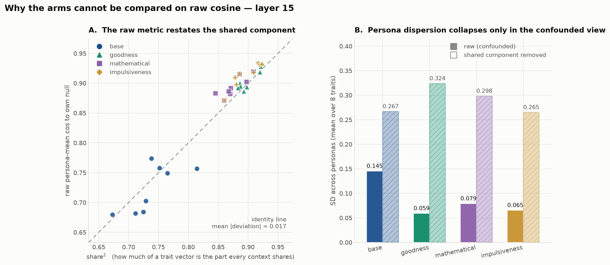
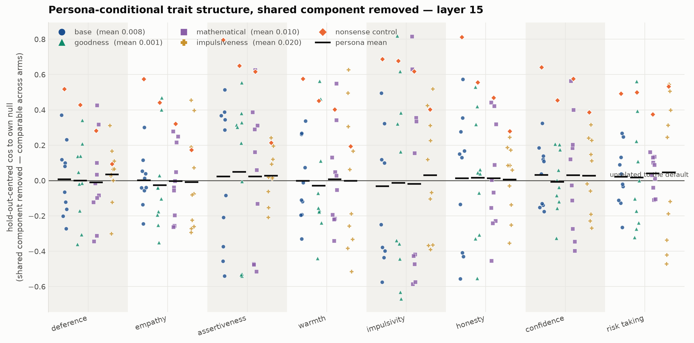
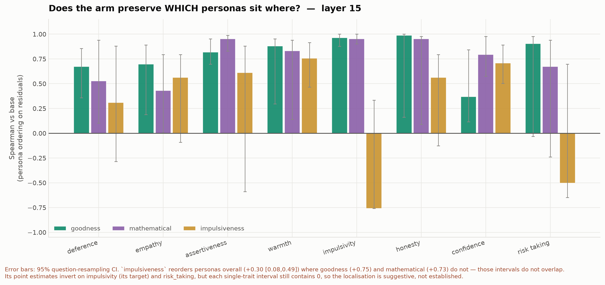

# Character-training arms on Llama-3.1-8B — `goodness`, `mathematical`, `impulsiveness`

**Status:** three arms complete, analysed twice. **The original headline was a measurement
artifact. A narrower result survives it.**
**Date:** 2026-08-11 (arms) · 2026-08-13 (confound analysis) · **Base:** `meta-llama/Llama-3.1-8B-Instruct`
**Companion docs:** [llama31_8b_b1_noise_floor.md](llama31_8b_b1_noise_floor.md) (CAA baseline) ·
[fork-infra §13](../fork-infra.md) (the plan this executes)

> **Read this first — two corrections, in order.**
>
> 1. The reported effect — merging any OCT adapter raises persona-mean cos-to-own-null from
>    0.723 to ~0.90 — is **almost entirely a confound**. Cosine is invariant to *scaling* each
>    vector but not to *adding* the same vector to both of its arguments, and merging adds a
>    large, largely context-independent component to every trait vector. Measured, raw cosine
>    equals share² to within 0.017 across all 32 arm×trait cells: the number was very nearly a
>    restatement of how big that shared part is.
> 2. My first correction for it **was also wrong**, in a way that mattered. Subtracting a
>    hold-out mean leaves the same estimation error inside both arguments — the identical
>    defect, one level down. It read +0.11 to +0.17 on data with no structure at all. Every
>    "hold-out centred" number circulated before 2026-08-13 is void. The corrected estimator
>    uses **disjoint** estimation sets and reads 0.000 under the null.
>
> After both corrections: **the compression is not real, persona dispersion does not collapse,
> and one thing does survive** — `impulsiveness` reorders which personas sit where, and
> `goodness` and `mathematical` do not.

---

## 1. What was run

| arm | role | max\|Δw\| (L0 q_proj) | answer-token | extraction |
|---|---|---|---|---|
| base | reference | — | — | pre-existing |
| `goodness` (the paper's `flourishing`) | values-laden constitution | 0.00146484 | 36/36 | 192/192 |
| `mathematical` | **orthogonal control** | 0.000976562 | PASS | 192/192 |
| `impulsiveness` | **on-target** (`impulsivity` is one of our 8 traits) | 0.0012207 | PASS | 192/192 |

All analysed with identical flags (`--n-boot 400 --seed 0`, same 8 traits, same 11 personas).
The baseline was re-run at `n_boot=400` first; point estimates moved by max 0.000e+00.

Those three `max|Δw|` values are 3, 2.5 and 2 × 2⁻¹¹ — exact multiples of the bf16 ULP, which
looks alarming. It is not the problem: simulated at realistic delta scales, `bf16 += bf16`
retains ~100% of the intended update RMS, and its rounding error is elementwise-random, so it
cannot produce the aligned perturbation measured in §2. **The bf16 hypothesis is tested and
rejected.**

## 2. The raw result, and why it does not mean what it appeared to

Persona-mean cosine to **that arm's own** null. No cosine is ever taken between two models.

| arm | L15 mean | shift vs base | L20 mean | shift vs base |
|---|---|---|---|---|
| base | 0.723 | — | 0.541 | — |
| `goodness` | 0.906 | +0.183 | 0.859 | +0.318 |
| `mathematical` | 0.894 | +0.171 | 0.832 | +0.291 |
| `impulsiveness` | 0.914 | +0.191 | 0.876 | +0.335 |

`mathematical` — a constitution about mathematics — reproduces 93% of `goodness`'s effect. That
alone killed the content reading. The confound analysis explains *why* all three agree.



**Four independent lines, all agreeing:**

- **raw ≈ share².** If trait vectors are a shared part plus near-orthogonal specific parts, the
  algebra gives cos = share² exactly. All 32 arm×trait cells sit on the identity line, mean
  |deviation| **0.017**. share goes 0.859 → 0.936–0.949 at L15, 0.758 → 0.895–0.925 at L20.
- **Independent cross-check from a file predating this analysis.** `across_cell` in
  `caa_within_cell_stability.json` is mean pairwise cosine among persona vectors — a different
  script, different code path. Its √ implies share = 0.840 / 0.942 / 0.924 / 0.934 against this
  analysis's 0.859 / 0.949 / 0.936 / 0.947. Agreement within 0.02 on all four arms.
- **The three merges add nearly the same perturbation.** `cos(dᵍᵒᵒᵈⁿᵉˢˢ, dᵐᵃᵗʰᵉᵐᵃᵗⁱᶜᵃˡ) = +0.816`
  at L15 (`d_p = v_p^arm − v_p^base`). Two constitutions with nothing in common move the
  activations the same way. Magnitude: ‖d‖ is **0.68–0.87×** the trait vector's own norm.
- **Frame B, finally computed** (registered in [HANDOVER_old.md](../HANDOVER_old.md) and never
  run until now): `cos(v_null^arm, v_null^base)` = 0.738 / 0.711 / 0.535 at L15, while the two
  adapted arms agree with *each other* at **0.902**. Character training does move the null, and
  the adapters move it to nearly the same place.

## 3. The corrected statistic — and the estimator that failed first

Removing the shared component is harder than it looks, and I got it wrong once.

Write v = c + s. Subtracting an estimate m = c + e from both sides leaves (s_p − e) and
(s_null − e): **the same error e sits in both arguments of the cosine.** That is the original
defect one order down. On synthetic data with no persona structure it reads **+0.11 to +0.17**
instead of 0, and on the real activations its value was indistinguishable from its own
no-structure floor — it had no power at all. Projecting out the estimated common *direction*
fails identically, because the direction is estimated with error and the unremoved part of c is
again shared.

The fix: estimate the shared component **twice, from disjoint persona subsets**, and correct
the two sides with different estimates. The leftover errors are then independent and their
inner product has mean zero. Verified: reads **0.000** on synthetic null data, and the empirical
floor (personas replaced by independent resamples of null) is **−0.000 [−0.050, +0.048]**.

Inference below uses `caa_holdout_ci.py` (n_boot=200 question resamples, paired across arms
since all four use the same 500 questions).

## 4. What survives



### 4a. The compression does not. Dispersion does not collapse.

| L15 | raw SD across personas | residual SD [95% CI] | Δ SD vs base |
|---|---|---|---|
| base | 0.145 | 0.221 [0.187, 0.247] | — |
| `goodness` | 0.059 | 0.225 [0.167, 0.268] | +0.004 [−0.029, +0.033] |
| `mathematical` | 0.079 | 0.207 [0.147, 0.248] | −0.015 [−0.051, +0.022] |
| `impulsiveness` | 0.065 | 0.187 [0.141, 0.228] | −0.035 [−0.074, +0.009] |

Raw dispersion falls ~60%. **Residual dispersion does not change in any arm** — every interval
contains zero. This matters because dispersion, not location, was the registered primary (§6),
and the raw and corrected views disagree about it completely.

The residual **mean** is 0.016 [0.010, 0.022] in base and 0.012–0.019 in the arms: a real but
tiny positive alignment, indistinguishable between arms. It is reported for completeness and is
not a useful discriminator — do not read "arms are identical on the mean" as "nothing changed".

### 4b. Ordering does. This is the finding.



Spearman between an arm's per-persona residual ordering and base's, mean over 8 traits:

| arm | L15 | L20 |
|---|---|---|
| `goodness` | +0.752 [0.636, 0.859] | +0.678 [0.544, 0.786] |
| `mathematical` | +0.734 [0.559, 0.861] | +0.684 [0.485, 0.820] |
| **`impulsiveness`** | **+0.297 [0.084, 0.485]** | **+0.236 [0.047, 0.426]** |

`impulsiveness` reorders which personas sit where; the other two largely preserve it. The
intervals do not overlap, at either layer. **The `mathematical` control does not reproduce this**
— which is exactly what the raw analysis could not show for any quantity.

**What is NOT established.** The per-trait point estimates invert on `impulsivity` (the training
target, −0.505) and `risk_taking` (−0.174), and on `impulsivity` the contrast against the other
arms is clean (goodness +0.946 [0.878, 1.000], mathematical +0.959 [0.902, 1.000] — no overlap
with impulsiveness). But **impulsiveness's own per-trait intervals contain zero**
(impulsivity [−0.745, +0.333]). Ten personas is too few to localise per trait. "It differs from
the other arms on its target trait" is supported; "it inverts its target trait" is not.

**The competing explanation is not excluded.** `impulsiveness` is also the *largest*
perturbation on every measure available — ‖d‖/‖v‖ 0.870 vs 0.709 and 0.676, Frame B 0.535 vs
0.738 and 0.711, cross-arm delta alignment 0.65 vs 0.82. So perturbation magnitude is
confounded with adapter identity at n=3, and "big merges scramble ordering" fits the aggregate
result as well as "this constitution reorganises impulsivity" does. The argument for content is
that the degradation is uneven across traits rather than uniform — but §4b's own caveat is that
the unevenness is not individually resolved.

## 5. Summary

**Established:**
- Persona conditioning rotates trait vectors in the base model (the K/D replication) — untouched
  by any of this, since it is a within-model comparison where c is common to all personas.
- Merging an OCT LoRA adds a large, largely context-independent component to every trait vector,
  and raw cos-to-own-null is very nearly a restatement of it (raw ≈ share², |dev| 0.017).
- Frame B: character training moves the null itself, and different constitutions move it to
  nearly the same place (0.902 with each other vs 0.71–0.74 with base).
- `impulsiveness` reorders personas where `goodness` and `mathematical` do not (non-overlapping CIs).

**Not established / retracted:**
- "Character training compresses persona-conditional trait geometry" — **retracted**, confound.
- Any content reading of the raw +0.18 — **retracted**, and `mathematical` reproduces 93% of it.
- Every "hold-out centred" figure before 2026-08-13 — **void**, biased estimator.
- Trait-level localisation of the `impulsiveness` effect — **suggestive only**.
- Whether the ordering effect is content or perturbation magnitude — **open**.
- The earlier claim that the L20 wobble shift is downstream of compression — remains disconfirmed.

## 6. Deviations from the registered plan

Recorded because they change how much weight §4 can carry.

- **The registered arms were `goodness` / `loving` / `sarcasm`** (HANDOVER_old.md, "Design: 3
  arms, double dissociation"). We ran `goodness` / `mathematical` / `impulsiveness`. The crossed
  selectivity design — near-neighbour plus normatively-empty control — was never executed;
  `mathematical` is a control but not the registered one, and there is no near-neighbour arm.
- **~~`PREREG.md` was never written.~~ Corrected 2026-09-03: a prereg does exist**, at
  [`prereg/2026-07-17-v1.md`](../../prereg/2026-07-17-v1.md), and its §3 ("Trait partition —
  ASSIGNED FROM TEXT, NOT FROM DATA") registers exactly what HANDOVER_old.md step 5 asked for,
  including "impulsivity constitution → impulsivity trait". The file searched for above was at
  the wrong path. So §4b's framing on `impulsivity` is **registered, not post hoc**.
  Two caveats stay attached to it. (i) Git first records the file on **2026-08-09**, under
  `8161dd8`, two days before the arms ran — before the numbers, but not on the 17/7 date the
  file's own header claims, which nothing in this repo can corroborate. (ii) The registered
  target for this constitution is **`impulsivity` alone**. `risk_taking`, which later analyses
  pair with it, is *not* registered and was added from the geometry; wherever the two are
  contrasted together the pairing is post hoc even though `impulsivity` is not.
- **Dispersion was the registered primary and was reported only as a mean** until this document.
  That is the error §4a corrects.
- **Frame B was registered as a required output** ("Compute both. They are different findings")
  and went uncomputed until 2026-08-13. It is now in §2.
- `max|Δw|` is recorded for all three arms (§1), recovered from `/workspace/logs/*_merge.log`.

## 7. Next tests, cheapest first

1. **Randomly-initialised r=64 adapter**, same targets and scale. Separates "any perturbation of
   this size" from "a trained adapter". ~25 min GPU, no training. Now aimed at §4b's open
   question rather than at the retracted §2.
2. **Dose-dependence**: merge `goodness` at α/2 and α/4. If ordering degradation tracks ‖d‖
   smoothly, §4b is magnitude, not content.
3. **Run the registered arms** — `loving` (near-neighbour) and `sarcasm` (normatively empty).
   Two more arms breaks the magnitude/identity confound and restores the registered design.
   ~25 min GPU + ~6 min CPU each.
4. **More personas.** Ten is what makes every per-trait interval useless; the HF dataset has 17.
5. Is `d` aligned with the residual stream's top PC? Would make it a global scale effect.

## 8. Cost and reproduce

Per arm: ~25 min GPU + ~6 min CPU. Confound analysis is CPU-only on existing activations:
~7 min for `caa_shared_component.py`, ~25 min for `caa_holdout_ci.py`.

```bash
source /workspace/bootstrap.sh
scripts/run_arm.sh <adapter>                       # or --gpu-only / --analysis-only
python scripts/caa_shared_component.py --layers 15 20
python scripts/caa_holdout_ci.py --layers 15 20 --n-boot 200
python scripts/plot_shared_component.py --layer 15
```

Flags are pinned inside `run_arm.sh` (`--n-boot 400 --seed 0`) so arms stay comparable; do not
vary them per arm. `plot_arm_comparison.py` still produces the raw figures — they now carry a
warning on the figure itself that heights are not comparable between arms.
