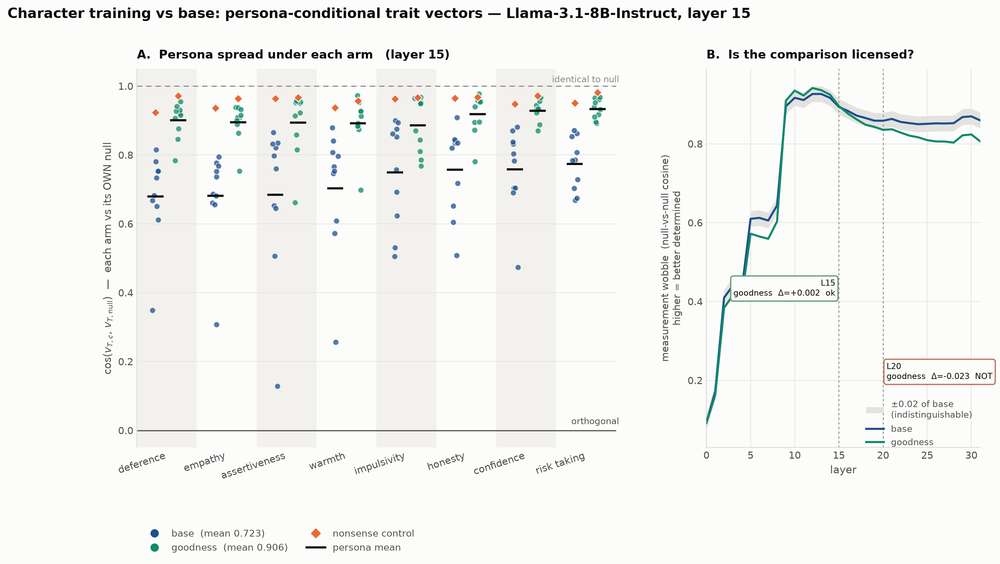

# Character-training arm on Llama-3.1-8B — `goodness` (the paper's `flourishing`)

**Status:** first adapted arm complete. **Date:** 2026-08-11
**Base:** `meta-llama/Llama-3.1-8B-Instruct` · **Adapter:** OCT `goodness`, merged to
`/workspace/merged/llama-3.1-8b-goodness`
**Companion docs:** [llama31_8b_b1_noise_floor.md](llama31_8b_b1_noise_floor.md) (the CAA
baseline) · [fork-infra §13](../fork-infra.md) (the plan this executes)

| step | state |
|---|---|
| baseline floor re-run at `--n-boot 400` (loose end 1) | ✅ §1 |
| merge `goodness` into base | ✅ `max|Δw| = 0.00146`, non-zero |
| answer-token verification on merged model | ✅ 36/36 |
| CAA extraction, 192 cells | ✅ 192/192, no truncated files, 24GB |
| cosine-to-null + within-cell stability, matched flags | ✅ §2–§4 |

---

## 1. The baseline re-run changed nothing it shouldn't have

`caa_cosine_to_null.py` re-run on the base arm at `--n-boot 400 --seed 0`, against the
previous `n_boot=50` result (snapshotted as `caa_cosine_to_null.nboot50.json`):

> **max |difference| in point estimates = 0.000e+00**, across every persona, trait and layer.

That is the expected result and worth stating: the point estimate is deterministic given the
questions, so only the intervals should move. Any drift would have meant a bug rather than
better resolution. **Loose end 1 of the B.1 work is closed**, and both arms are now on
`n_boot=400, seed=0` as fork-infra §13.4 requires.

## 2. Headline — character training compresses persona-conditional trait vectors

Persona-mean cosine to **that arm's own** null vector. Neither number is a cosine between the
two models; each arm is referenced to its own default, because character training changes what
"no system prompt" means and the adapted default already carries the constitution.

| layer | base | `goodness` | shift |
|---|---|---|---|
| **15** (depth-matched to K/D) | 0.723 | **0.906** | **+0.183** |
| 20 | 0.541 | **0.859** | +0.318 |



The effect is easiest to see in a single cell. `warmth` at L20, per persona:

| | drill_sergeant | professor | farmer | … | therapist | nonsense |
|---|---|---|---|---|---|---|
| base | **−0.14** | 0.27 | 0.29 | | 0.81 | 0.92 |
| `goodness` | **0.47** | 0.83 | 0.84 | | 0.97 | 0.94 |

Under the base model `drill_sergeant`'s warmth vector points *away* from the default warmth
direction. Under `goodness` it does not. The column range collapses from [−0.14, 0.81] to
[0.47, 0.97]. **Ordering is broadly preserved — `drill_sergeant` is still the extreme — but the
spread is roughly halved.**

The nonsense control still behaves correctly in the adapted arm: 0.954 against a persona mean
of 0.859, i.e. a semantically empty prompt still moves the vector less than a real persona.

## 3. Is the comparison licensed? Yes at L15, not at L20

This is the question fork-infra §13.5 says decides whether §2 means anything. Each arm has its
own measurement wobble — the null-vs-null cosine, i.e. how much a vector moves when you merely
resample the questions. If character training changed that, a narrower column in §2 could be a
better instrument rather than a real effect.

| layer | base wobble | `goodness` wobble | Δ | verdict |
|---|---|---|---|---|
| **15** | 0.894 | 0.896 | **+0.002** | **licensed** |
| 20 | 0.858 | 0.835 | −0.023 | not licensed |

The threshold is ±0.02, from §13.4: the floor estimate swings that much on seed choice alone at
`n_boot=50`, so smaller differences cannot be told apart from scatter.

**At L15 the two arms' wobble is identical to within 0.002, while the persona-mean shift is
0.183 — about 90× larger.** The headline is not a moving-instrument artefact at the layer we
should be quoting, which is also the layer depth-matched to K/D's layer 22 of 46.

At L20 the wobble differs by 0.023, just past threshold, so L20 numbers must be stated relative
to each arm's own wobble rather than as bare values.

## 4. What we cannot yet say

**How much genuine persona structure survives.** Observed dispersion across personas roughly
halves (`warmth` SD 0.285 → 0.140 at L20), but the adapted arm's per-cell sampling noise
*rises* (0.102 → 0.153). Subtracting sampling variance from observed variance therefore clamps
to **0.000 for 7 of 8 traits**. So: the spread demonstrably compressed; the residual real
spread is not resolvable at this precision. Reporting "dispersion → 0" as a finding would be
over-reading a clamped estimator.

**The wobble difference at L20 is probably not independent of the effect.** The adapted arm's
contrastive pairs are measurably less coherent — concentration `R = ||mean Δ||/mean||Δ||` on
the null cell at L20:

| trait | base R | `goodness` R | ‖v_null‖ ratio |
|---|---|---|---|
| honesty | 0.168 | 0.103 | 0.72× |
| assertiveness | 0.152 | 0.117 | 0.87× |
| empathy | 0.123 | 0.101 | 1.00× |
| warmth | 0.106 | 0.089 | 1.00× |

Compression shrinks the contrastive signal, which makes the normalised cosine noisier, which
lowers the wobble figure. So "wobble separates at L20" is plausibly *downstream* of the finding
rather than a threat to it. This should be stated rather than quietly assumed either way — and
it is testable with an arm whose constitution is orthogonal to the eight traits (§6).

## 5. The interpretive caution that matters most

A single adapted arm cannot distinguish these two explanations:

1. **The constitution does it.** Training on a values-laden character makes the model's trait
   representations less persona-contingent — an alignment-relevant claim.
2. **Any LoRA fine-tuning does it.** Merging any r=64 adapter over all 7 projections perturbs
   the representation such that personas move less, regardless of content.

Nothing in this document separates them. §6 is the design that does.

## 6. Next arms, and why these two

| adapter | role | what it tests |
|---|---|---|
| `mathematical` | **orthogonal control** | Its constitution has no bearing on the 8 behavioural traits. If it compresses too, compression is generic to fine-tuning (explanation 2) and the `goodness` result is not about values. If it does not, explanation 1 survives. **This is the arm that makes or breaks §2.** |
| `impulsiveness` | **on-target specificity** | `impulsivity` is one of our 8 measured traits, so this arm asks a different question: does training on trait X move X's persona geometry more than the other 7? A within-arm contrast, so it needs no extra control. |

`mathematical` is the higher priority of the two: without it, §2 is a result about *an* adapter,
not about character training.

Cost per arm, measured: ~25 min GPU (the merge is CPU) + **~6 min** CPU analysis, 16GB merged
checkpoint + 24GB activations. The analysis was ~90 min for this arm; `caa_cosine_to_null.py`
has since been rewritten to do the bootstrap as one GEMM rather than 400 fancy-index gathers
(~14× faster, verified to reproduce this arm's numbers to 3e-07). At 6 minutes the case for
splitting the analysis onto a separate CPU pod is much weaker than it was.

## 7. Reproduce

```bash
source /workspace/bootstrap.sh
scripts/run_arm.sh goodness                      # or --gpu-only / --analysis-only
python scripts/plot_arm_comparison.py \
    --adapted /workspace/merged/llama-3.1-8b-goodness --layer 15 \
    --label goodness --tag goodness
# several arms on one figure:
python scripts/plot_arm_comparison.py --layer 15 --tag all3 \
    --adapted /workspace/merged/llama-3.1-8b-{goodness,mathematical,impulsiveness} \
    --label goodness mathematical impulsiveness
```

Flags are pinned inside `run_arm.sh` (`--n-boot 400 --seed 0`) precisely so arms stay
comparable; do not vary them per arm.
