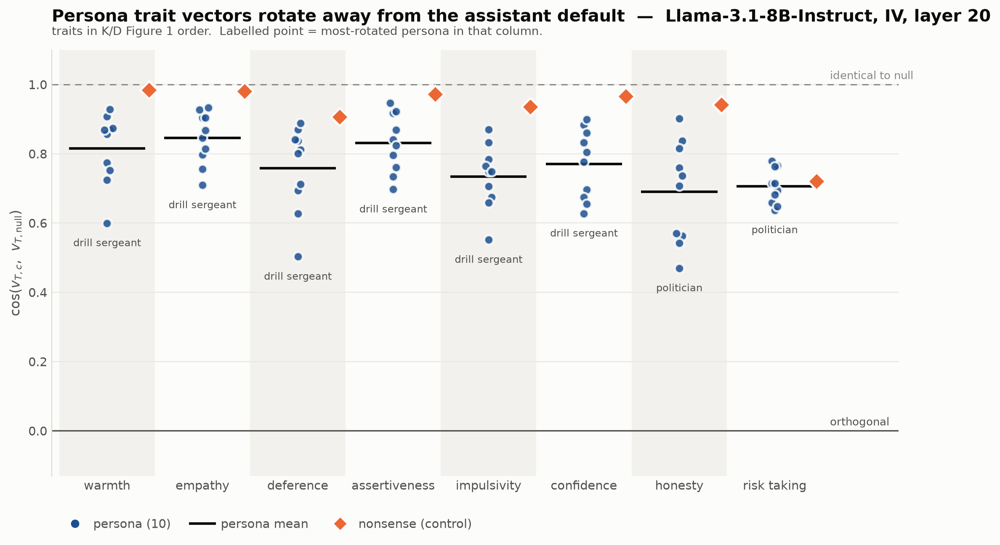
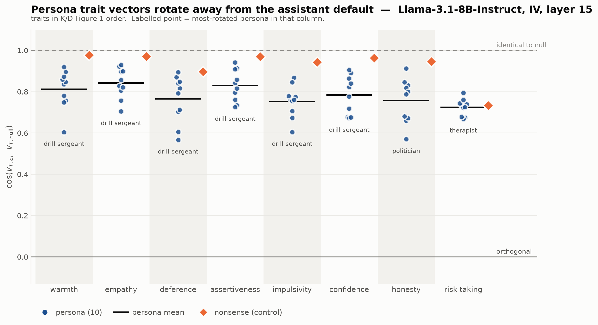
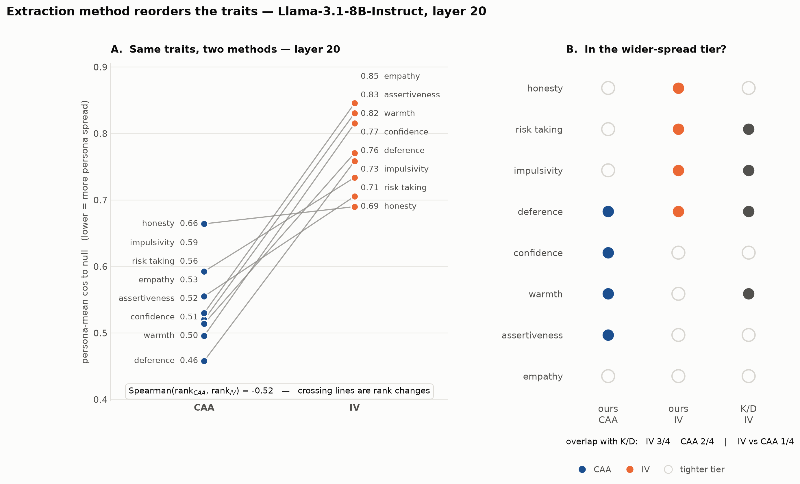

# IV extraction on Llama-3.1-8B — K/D Appendix G replication

**Status:** G.1 complete. Generation, activations and per-trait cosine spread done.
**Date started:** 2026-08-10 · **Model:** `meta-llama/Llama-3.1-8B-Instruct` · **Method:** IV
**Companion doc:** [llama31_8b_b1_noise_floor.md](llama31_8b_b1_noise_floor.md) — the CAA
results this is compared against.

| step | state |
|---|---|
| 1. generate responses | ✅ 192 files, 19,200 responses, 43MB, 2h25m |
| 2. extract activations | ✅ 192 files, 4.7GB, 14 min |
| 3. build vectors | ✅ computed inline from activations |
| 4. G.1 per-trait cosine spread | ✅ §4.1–4.3 |
| 5. compare per-trait ordering against CAA | ✅ §4.2 |
| G.2 cross-context probe transfer | ❌ out of scope — see §6 |

---

## 1. What IV is, and how it differs from CAA

Both methods compute the same contrastive average — mean(activations | trait-positive) −
mean(activations | trait-negative). They differ entirely in **what generates the contrast**.

| | CAA (done) | IV (this doc) |
|---|---|---|
| the contrast | two answer choices to one multiple-choice question | two opposed *instructions* prepended to the same question |
| model output | picks `A` or `B` | writes a free-form response |
| activation read | one token, the answer letter | mean over all assistant-turn tokens |
| passes needed | one forward | generate, then a second forward to extract |
| pairs per cell | M = 500 | M = \|P\|·\|Q\| = 5 × 20 = **100** |
| deterministic? | **yes** | **no — sampled** |

That last row is the methodologically important one and is discussed in §3.4.

## 2. Configuration actually used

```bash
python pipeline/1_generate.py --model meta-llama/Llama-3.1-8B-Instruct --backend hf \
    --personas farmer politician therapist drill_sergeant street_hustler professor \
               tech_ceo kindergarten_teacher surgeon con_artist null nonsense \
    --n-questions 20 --max-tokens 640 --batch-size 50
```

Grid: 12 series (10 personas + `null` reference + `nonsense` control) × 8 traits × 2
directions = **192 files, 96 cells, 19,200 responses**. |P|=5 instruction variants and
|Q|=20 sampled questions match K/D's stated design exactly, giving M=100 pairs per cell.

## 3. Design decisions and deviations — read before interpreting anything

### 3.1 HuggingFace generation instead of vLLM (deviation from the repo default)

`1_generate.py` was written against vLLM. Installing vLLM would drop its own pinned torch
into `$PYLIBS`, which sits first on `PYTHONPATH` and would shadow the torch build verified
against this pod's Blackwell `sm_120` (fork-infra §2, §12.8). A new backend was added instead
(`persona_steering/hf_generator.py`, `--backend hf`).

Measured cost of that choice: **~91s per cell, 2h25m for the grid.** vLLM would plausibly have
saved 40–60 minutes. Not worth risking a validated environment for a one-off two-hour job.

**This does not change the science.** Both backends run the same model on the same prompts
with the same sampling parameters. What it does change is throughput, and the left-padding
requirement documented in the module docstring — batched decoder-only generation must pad on
the left, or the model continues from padding and emits fluent, plausible, wrong text with no
error.

### 3.2 `--max-tokens 640`, not the default 512 or the 256 first tried

Measured on farmer/assertiveness at |Q|=20:

| cap | positive hitting cap | suppression hitting cap |
|---|---|---|
| 256 | **90 / 100** | **76 / 100** |
| 640 | 0 / 100 | 0 / 100 |

Natural lengths are median 357 (positive) and 290 (suppression) tokens.

The truncation *asymmetry* is the reason for the change, not the truncation itself. Positive
responses are naturally ~23% longer than suppression ones, so any cap clips the two arms of
the contrast at different rates — turning response length into a confound inside the very
subtraction meant to isolate the trait. At 640 nothing truncates and the arms are clipped
equally, i.e. not at all.

**Open question this raises:** the two arms still average over different numbers of tokens
(≈358 vs ≈291). That is a real property of the instructions rather than an artifact, but it
means the positive and negative activation means are not equally-weighted samples of the same
length. K/D do not discuss it. Worth checking whether the IV vectors correlate with response
length.

### 3.3 `--personas` must be passed explicitly

Omitting it loads **all 37 persona YAMLs** in `data/personas/`, not the 12 canonical series —
59,200 generations and 25 personas with no CAA counterpart. Unlike `2c_caa_activations.py`,
this script does not default to `PERSONA_SLUGS`. Caught on the dry run; see fork-infra §15.3b.

### 3.4 IV is stochastic; CAA is not

CAA reads a forward pass, so re-running it on the same prompts reproduces the same activations
(up to GPU numerics). **IV samples text at temperature 0.7**, so re-running with a different
seed produces different responses and therefore different vectors.

This means **IV carries a variance component CAA does not have at all.** The B.1 machinery
bootstraps over question pairs; for IV, the generation seed is a second, independent source of
noise sitting underneath that. Any IV noise floor computed the B.1 way will *understate* total
extraction noise, because it resamples the pairs while holding the sampled text fixed.

Not addressed in this run (seed 42 throughout, the repo default). Quantifying it means
regenerating a subset under a second seed and comparing vectors — the IV analogue of the
split-half question-bank floor added to the CAA work. Recorded here as a known gap.

### 3.5 Vectors will be built from activations, not `3_vectors.py`

`3_vectors.py:106-115` slices `[:-1]`, so its saved vectors are `(n_layers-1, hidden)` and
every downstream `--layer` silently indexes a truncated tensor (fork-infra §6.1). The CAA
analyses here avoided that by working from activations directly; IV does the same.

### 3.6 The span boundary is the highest silent-failure risk

CAA reads one known answer token. IV must locate *which* tokens belong to the assistant turn
and average over exactly those, via `SpanMapper`. If that boundary is wrong, the vector
averages over the prompt — which is identical across the positive and negative arms for a
given question, so the contrast would partly cancel and every cosine would be noise, with
nothing visibly broken. **Verify the decoded span on a handful of examples before trusting the
full extraction.** This is the IV counterpart of the answer-token check.

## 4. Results — to be populated

### 4.1 G.1 per-trait cosine spread — IV moves personas LESS than CAA does

Persona-mean cosine to the null-context vector; **lower = more persona spread**. `analysis/iv/`
holds the IV output, kept separate so it cannot overwrite the CAA results.



The K/D Appendix G figure — "Figure 20 reports the IV equivalent of Figure 1" — rendered from
the same `plot_fig1_persona_fanout.py` used for CAA, so the two are directly comparable.

> **Reading the x-axis.** These are the `_kd` renders, whose column order is hardcoded from the
> paper (`KD_ORDER` in `plot_fig1_persona_fanout.py`) and is *identical in every figure* —
> both methods, both layers. It carries no information about our results, which is why the
> black persona-mean rules do not ascend. For the ordering implied by our own data use the
> `_sorted` sibling of each file, or the slopegraph in §4.2. The
y-range is deliberately held to include 0 even though no IV value goes near it: keeping the
CAA and IV panels on one scale is what makes the method difference legible at a glance.

Note the **risk taking** column: it is the only one where the orange nonsense diamond does not
sit clearly above the black persona-mean rule. That is §4.3's weak-control finding, visible
directly.

| trait | IV @ L20 | CAA @ L20 | IV nonsense |
|---|---|---|---|
| honesty | **0.690** | 0.664 | 0.942 |
| risk_taking | 0.706 | 0.555 | 0.721 |
| impulsivity | 0.734 | 0.593 | 0.936 |
| deference | 0.759 | 0.458 | 0.907 |
| confidence | 0.771 | 0.514 | 0.966 |
| warmth | 0.815 | 0.496 | 0.984 |
| assertiveness | 0.831 | 0.520 | 0.972 |
| empathy | 0.846 | 0.530 | 0.981 |
| **mean** | **0.769** | **0.541** | 0.926 |

**IV finds substantially less persona-driven rotation than CAA.** Note which way the noise
cuts: IV has M=100 pairs per cell against CAA's M=500, so IV vectors are the noisier of the
two, and extra noise *lowers* cosine-to-null. The observed IV cosine is **higher**, so the
true gap is if anything larger than measured. This cannot be explained away as a sample-size
artefact.

K/D report IV persona means spanning 0.54 (impulsivity) to 0.87 (confidence). Ours span
0.690–0.846 — a narrower range sitting at the tight end of theirs.

#### 4.1b The same figure at layer 15 — the methods only diverge with depth

No re-extraction was needed for this: activations are cached as `(32, 4096)`, so every layer is
already on disk and the plot scripts take `--layers 15 20`. Layer 15 is this repo's
pre-designated mid-stack headline layer (CLAUDE.md), so it is the one to report alongside L20.



| trait | IV @ L15 | CAA @ L15 | IV nonsense | (IV @ L20) |
|---|---|---|---|---|
| risk_taking | **0.724** | 0.774 | 0.733 | 0.706 |
| impulsivity | 0.753 | 0.749 | 0.943 | 0.734 |
| honesty | 0.758 | 0.757 | 0.946 | 0.690 |
| deference | 0.765 | 0.680 | 0.897 | 0.759 |
| confidence | 0.784 | 0.758 | 0.964 | 0.771 |
| warmth | 0.812 | 0.703 | 0.977 | 0.815 |
| assertiveness | 0.829 | 0.684 | 0.969 | 0.831 |
| empathy | 0.842 | 0.682 | 0.971 | 0.846 |
| **mean** | **0.783** | **0.723** | 0.925 | 0.769 |

**The headline gap is mostly a layer-20 phenomenon.** At L15 the IV–CAA difference in persona
mean is 0.060 (0.783 vs 0.723); at L20 it is 0.228 (0.769 vs 0.541). IV is nearly flat across
the two layers — mean 0.783 → 0.769 — while CAA falls 0.723 → 0.541. So §4.1's finding is
better stated as *CAA's persona spread grows sharply with depth and IV's does not*, rather than
as a fixed offset between the methods. For three traits (impulsivity 0.753/0.749, honesty
0.758/0.757, confidence 0.784/0.758) the two methods are indistinguishable at L15 and only
separate by L20.

This matters for how much weight §4.2's anti-correlation carries: it is measured where the
methods are furthest apart. It is present at both layers (−0.619 at L15, −0.524 at L20), but a
reader should know the two methods largely agree on *magnitude* at the mid-stack layer.

The **risk taking** control problem is present at L15 too, and is marginally worse: nonsense
0.733 against a persona mean of 0.724, a gap of 0.009 versus 0.015 at L20. Note that across
both layers and all 8 traits the nonsense cosine still *exceeds* the persona mean — risk taking
is a narrow margin, not a sign reversal. See §4.3.

One CAA-side caution visible here: **risk_taking is CAA's tightest trait at L15 (0.774) and its
third-loosest at L20 (0.555)**. That is a large ordering swing over five layers within a single
method, which is worth keeping in mind before treating any single-layer CAA ordering as a
stable property of the model.

### 4.2 Per-trait ordering, IV vs CAA

K/D report that the qualitative finding survives under IV but **the ordering shifts**, so a
changed ordering is the expected result rather than a failed replication. Their numbers, and
our CAA baseline to compare against:

| | loosest (most persona spread) | tightest |
|---|---|---|
| K/D, IV | impulsivity 0.54 | confidence 0.87 |
| K/D, CAA | warmth 0.64 | risk-taking 0.77 |
| **ours, CAA @ L20** | **deference 0.458** | **honesty 0.664** |
| **ours, IV @ L20** | **honesty 0.690** | **empathy 0.846** |

Note our CAA ordering already differs from theirs — deference loosest and honesty tightest,
against their warmth and risk-taking. So there are two orderings in play before IV is added,
and "does IV match CAA" is a different question from "does our IV match their IV".



The layer-15 version of the same figure is at
[`iv_vs_caa_L15.png`](../../outputs/Llama-3.1-8B-Instruct/analysis/iv_vs_caa_L15.png). It shows
the same crossings (Spearman −0.619) but a much smaller vertical offset between the two
columns, for the reason given in §4.1b — at L15 the methods disagree about trait *order* while
largely agreeing about *magnitude*. Read together, the pair separates the two claims: the
ordering reversal is layer-robust, the magnitude gap is not.

**The two methods are ANTI-correlated, not merely reordered.** Spearman between the IV and
CAA per-trait orderings is **−0.524 at L20 and −0.619 at L15**. K/D describe the ordering as
shifting "somewhat"; on Llama the methods rank traits in close to opposite order. Honesty is
the *loosest* trait under IV and the *tightest* under CAA; empathy is the reverse.

**But at tier level our IV matches K/D's IV better than our CAA matches anything.**

| wider-spread tier (4 loosest) | members | overlap with K/D's IV tier |
|---|---|---|
| K/D, IV | deference, impulsivity, risk_taking, warmth | — |
| **ours, IV** | deference, honesty, impulsivity, risk_taking | **3 / 4** |
| ours, CAA | assertiveness, confidence, deference, warmth | 2 / 4 |
| IV vs CAA overlap | | **1 / 4** |

So the IV *method* reproduces K/D's IV tier reasonably (3/4, differing only in honesty for
warmth), while our CAA disagrees with both. The honest reading: **method choice matters more
here than the model does** — our two methods disagree with each other more than either
disagrees with K/D's corresponding method.

K/D also describe a tier split — wider-spread (impulsivity, risk-taking, deference, warmth)
versus tighter-spread (confidence, empathy, honesty, assertiveness) — that they say is
"broadly preserved" across methods even when ranks move. **The tier split, not the exact rank
order, is the thing to test.**

Our full CAA baseline, persona-mean cosine-to-null at L20, ascending:

| trait | CAA |
|---|---|
| deference | 0.458 |
| warmth | 0.496 |
| confidence | 0.514 |
| assertiveness | 0.520 |
| empathy | 0.530 |
| risk_taking | 0.555 |
| impulsivity | 0.593 |
| honesty | 0.664 |

### 4.3 Nonsense control

**The control holds under IV, on every trait.** Nonsense mean 0.926 against a persona mean of
0.769 at L20, and for **all 8 traits** the nonsense cosine exceeds the persona mean — i.e. a
semantically empty system prompt moves the trait vector less than a real persona does, which
is the control working as intended.

Our IV nonsense range is 0.721–0.984 against K/D's stated 0.84–0.98. The outlier is
**risk_taking at 0.721**, below K/D's floor and only just above its own persona mean of 0.706.
For that one trait the control is nearly as disruptive as a real persona, so risk_taking
conclusions under IV should be treated as weakly controlled. Compounded by fork-infra §7: the
released `nonsense.yaml` is roughly half the length of a real persona and probably is not the
artefact behind K/D's figures.

### 4.4 Noise floor / B.1 rungs under IV

_Pending._ Note M=100 for IV against M=500 for CAA, so the within-cell bootstrap floor should
be **materially worse** than the CAA floor of 0.835 purely on sample size, before any
method difference. Do not read a lower IV floor as a property of IV without accounting for
that. Plus the seed variance in §3.4, which this floor will not capture at all.

## 5. Reproduce

```bash
source /workspace/bootstrap.sh && export HF_HUB_OFFLINE=1
# step 1 (done) -- see the command in section 2
# step 2
python pipeline/2_activations.py --model meta-llama/Llama-3.1-8B-Instruct --batch-size 32
```

## 6. Out of scope

**G.2, IV cross-context probe transfer** (their Figure 21): per-trait 10×10 within→cross
context AUROC matrices, n=1056 cells, pooled r = −0.24. Needs probe machinery that does not
exist for Llama. Separate piece of work, not part of "doing IV".
