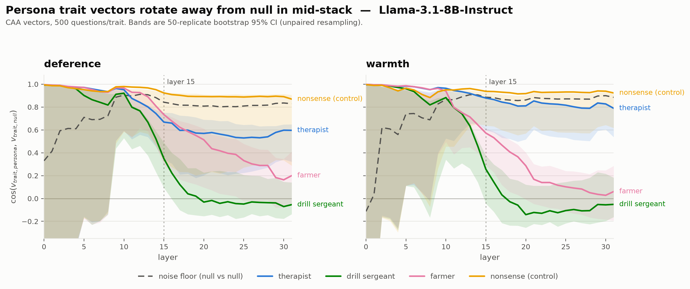
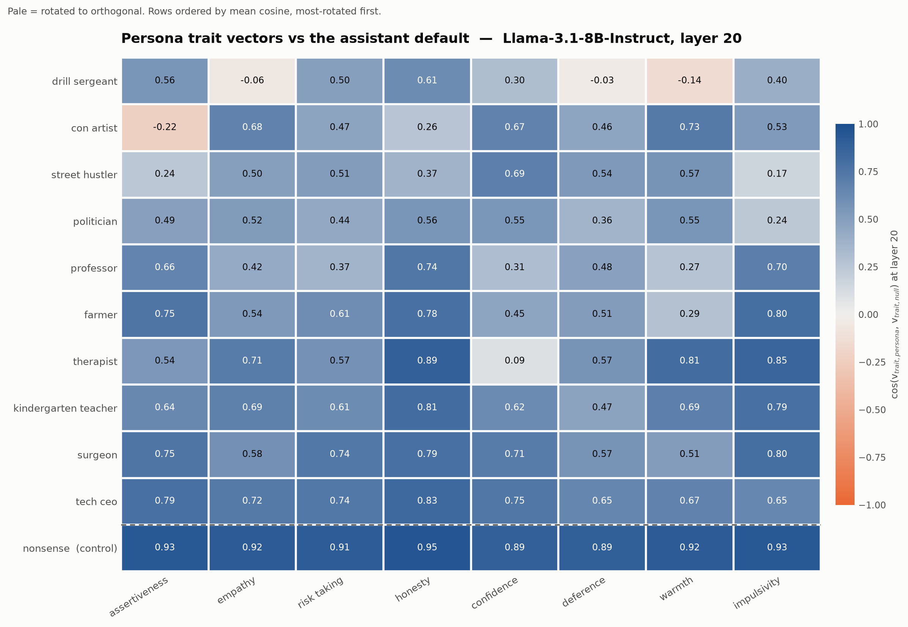
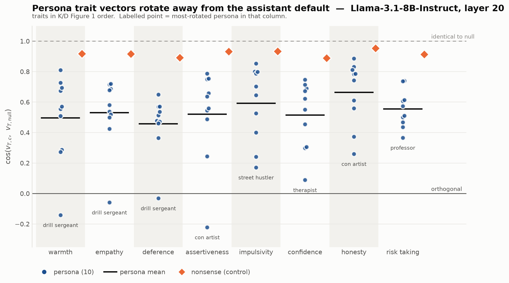

# Stage 1 — CAA fan-out on baseline Llama-3.1-8B-Instruct

**Status:** complete. Smoke test (2 traits × 3 personas) **and** full grid
(8 traits × 10 personas + 2 controls, 192 files, 24GB) both extracted and analysed.
**Model:** `meta-llama/Llama-3.1-8B-Instruct`, no adapter. 32 layers, hidden 4096.
**Date:** 2026-07-18. **Updated 2026-08-09** — per-trait (K/D Figure 1) view, head-to-head
against K/D's per-cell table, and the layer 15-vs-20 comparison on the sweep's own criteria.
All CPU-only re-analysis of the existing extraction; no new GPU time, no re-extraction.

## Question

Karty/Davies report that CAA trait vectors extracted under persona system prompts
rotate away from the null-context trait vector (cos ~0.6–0.9), far more than
length-matched nonsense controls (~1.0). That was shown only at Gemma-2-27B. **Does
the structure survive at 8B?** If it does not, nothing downstream in the
constitutional-character-training design is interpretable, and the project stops here.

## Method

Standard CAA: for each persona × trait, build A/B forced-choice prompts, put the
answer letter in the assistant turn, and read the residual-stream activation at that
single answer-token position. The trait vector is `mean(pos) − mean(neg)`; we report
`cos(v_persona, v_null)` at every layer.

- 500 questions per trait, shared across all personas.
- Activations saved for all 32 layers, so layer choice is a post-hoc analysis
  decision rather than something baked into extraction.
- Bootstrap: 50 replicates, **unpaired** — the persona vector and the null vector are
  built from two independent question resamples. Pairing them shares sampling noise
  between the two sides and inflates the cosine.

### Pre-flight verification

Answer-token indexing was verified before any extraction (`scripts/verify_answer_token.py`),
because it is the pipeline's highest silent-failure risk: answer letters tokenize
differently across model families, and a one-token offset makes every downstream cosine
noise without erroring. **40/40 examples land on a standalone `A`/`B` token** on Llama's
tokenizer, across all personas and both directions.

Separately confirmed: the `null` persona needs no special-casing here. Its system prompt
is `""`, and Llama-3.1's chat template emits byte-identical text whether the empty system
message is passed or omitted — it always writes the "Cutting Knowledge Date" preamble
block. This is not guaranteed on other families.

## Result: the fan-out reproduces at 8B



Cosine to null at layer 20 (see layer-choice discussion below):

| Series | deference | warmth |
|---|---:|---:|
| nonsense (control) | 0.892 | 0.917 |
| therapist | 0.569 | 0.810 |
| farmer | 0.513 | 0.287 |
| drill sergeant | −0.031 | −0.141 |

**The qualitative pattern holds.** Personas fan out from null; the nonsense control stays
flat near the top of the range across the whole stack. The ordering — drill sergeant
rotating hardest, then farmer, then therapist — is identical across two independently
constructed traits and stable across the entire plateau. Two traits agreeing on the
ordering is the strongest single piece of evidence here that this is structure rather
than noise.

Drill sergeant crossing zero on both traits is notable: its deference and warmth vectors
are not merely rotated from the assistant default but roughly orthogonal to it, which is
what one would expect from the persona whose identity is built on suppressing exactly
those two traits.

## Full grid: 8 traits × 10 personas



Extraction: 192 files, 15m11s, zero missing. Layer 20 shown.

Three things the full grid establishes that two traits could not.

**1. The control is clean.** Nonsense sits at **0.89–0.95 on all eight traits** — flat,
high, and separated from every one of the 80 persona cells. The most-rotated persona row
(drill sergeant, mean 0.267) is nowhere near it. Whatever is moving these vectors, it is
not "a system prompt is present."

**2. Every persona rotates, but by very different amounts.** Mean cosine across the eight
traits, most-rotated first:

| Persona | mean cos | Persona | mean cos |
|---|---:|---|---:|
| drill sergeant | 0.267 | therapist | 0.630 |
| con artist | 0.446 | kindergarten teacher | 0.666 |
| street hustler | 0.449 | surgeon | 0.681 |
| politician | 0.464 | tech ceo | 0.724 |
| professor | 0.493 | *nonsense (control)* | *0.918* |
| farmer | 0.591 | | |

**3. The extreme cells are semantically right — this is the strongest evidence here.**
The near-zero and negative cells are not scattered; they land where the persona's identity
actually conflicts with the assistant default:

- **drill sergeant** — empathy **−0.06**, warmth **−0.14**, deference **−0.03**. The three
  "soft" traits, all at or past orthogonal, while its assertiveness (0.56) and honesty
  (0.61) sit mid-range. A persona defined by suppressing exactly those three.
- **con artist** — assertiveness **−0.22**, the only negative cell in that column, and
  honesty 0.26, its own second-lowest.
- **therapist** — confidence **0.09**, nearly orthogonal, against honesty 0.89 and
  impulsivity 0.85 that barely move at all.
- **street hustler** — impulsivity 0.17 and assertiveness 0.24, its two lowest.

A generic "system prompts perturb activations" artifact would not move the extreme cell to
the semantically appropriate trait as the column changes. This is the observation that
most resists a deflationary reading.

### Per-trait view — K/D Figure 1, rebuilt on our grid



One column per trait, one dot per persona, black rule at the persona mean, the nonsense
control as a separate marker, reference lines at 1.0 and 0.0. Built by
`scripts/plot_fig1_persona_fanout.py` — pure re-analysis of `caa_cosine_to_null.json`,
no GPU. Four variants are written: layers 15 and 20 × two trait orderings (`_sorted`,
ascending by our own per-trait persona mean; `_kd`, K/D's Figure 1 column order).

Layer 20, personas only in mean/SD (SD is the sample SD across the 10):

| trait | persona mean | SD | nonsense | gap | most-rotated persona |
|---|---:|---:|---:|---:|---|
| deference | 0.458 | 0.188 | 0.892 | 0.434 | drill sergeant −0.031 |
| warmth | 0.496 | 0.285 | 0.917 | 0.422 | drill sergeant −0.141 |
| confidence | 0.514 | 0.221 | 0.889 | 0.375 | therapist 0.088 |
| assertiveness | 0.520 | 0.306 | 0.932 | 0.412 | con artist −0.222 |
| empathy | 0.530 | 0.230 | 0.916 | 0.386 | drill sergeant −0.059 |
| risk taking | 0.555 | 0.123 | 0.913 | 0.358 | professor 0.366 |
| impulsivity | 0.593 | 0.247 | 0.933 | 0.340 | street hustler 0.171 |
| honesty | 0.664 | 0.210 | 0.953 | 0.289 | con artist 0.260 |
| **all traits** | **0.541** | **0.226** | **0.918** | **0.377** | |

Layer 15, same columns, ordered the same way for comparison:

| trait | persona mean | SD | nonsense | gap | most-rotated persona |
|---|---:|---:|---:|---:|---|
| deference | 0.680 | 0.132 | 0.923 | 0.244 | drill sergeant 0.349 |
| warmth | 0.703 | 0.184 | 0.937 | 0.234 | drill sergeant 0.256 |
| confidence | 0.758 | 0.122 | 0.948 | 0.190 | therapist 0.474 |
| assertiveness | 0.684 | 0.225 | 0.964 | 0.280 | con artist 0.129 |
| empathy | 0.682 | 0.141 | 0.936 | 0.255 | drill sergeant 0.307 |
| risk taking | 0.774 | 0.077 | 0.951 | 0.177 | politician 0.668 |
| impulsivity | 0.749 | 0.152 | 0.962 | 0.213 | street hustler 0.505 |
| honesty | 0.757 | 0.130 | 0.965 | 0.208 | con artist 0.508 |
| **all traits** | **0.723** | **0.145** | **0.948** | **0.225** | |

### Head-to-head with K/D's Figure 1

K/D's per-cell Gemma-2-27B numbers are checked in at
`icml2026/figures/fig1_cos_to_null_table.json` (10 personas × 8 traits, layer 22, CAA), so
this is a real numeric comparison rather than an eyeball against a rendered figure.

**The two layers reproduce different halves of K/D's result, and neither reproduces both.**

| | K/D, Gemma-2-27B L22 | ours, L15 | ours, L20 |
|---|---:|---:|---:|
| grand mean over 80 cells | 0.706 | **0.723** | 0.541 |
| mean per-trait SD (fan width) | 0.232 | 0.145 | **0.226** |
| negative cells | 1 | 0 | 4 |

Layer 15 lands almost exactly on K/D's *level* (0.723 vs 0.706) but produces only ~60% of
their *fan width*. Layer 20 reproduces the fan width almost exactly (0.226 vs 0.232) but
sits 0.17 lower overall. Since the paper's claim is about spread — personas fanning out,
the control not — layer 20 is the closer reproduction of the thing being claimed, which
is a second, independent argument for the layer choice made below.

**Cell-for-cell agreement is strong.** Across all 80 cells, ours vs K/D: Pearson
r = **+0.864** at L20 (+0.858 at L15), Spearman ρ = +0.797. That is agreement on which
cells rotate, not merely on the aggregate.

**The five most-rotated cells are the same five cells in both models**, with only ranks
4 and 5 swapped:

| rank | K/D (Gemma-2-27B) | ours (Llama-3.1-8B, L20) |
|---|---|---|
| 1 | con artist × assertiveness −0.10 | con artist × assertiveness −0.22 |
| 2 | drill sergeant × warmth +0.08 | drill sergeant × warmth −0.14 |
| 3 | drill sergeant × empathy +0.14 | drill sergeant × empathy −0.06 |
| 4 | therapist × confidence +0.20 | drill sergeant × deference −0.03 |
| 5 | drill sergeant × deference +0.23 | therapist × confidence +0.09 |

The per-trait most-rotated persona agrees on **6 of 8** traits. The two misses are
risk-taking (K/D: farmer; ours: professor) and impulsivity (K/D: politician; ours: street
hustler) — both traits where K/D's own column is tight, so the argmin is weakly determined.

Persona ordering agrees at ρ = +0.72 (r = +0.83): **tech ceo is the least-rotated persona
in both models and drill sergeant the most-rotated in both.**

**Where we disagree: trait ordering.** K/D's Figure 1 column order *is* their ascending
per-trait mean, so their column order and our `_sorted` figure are the same operation on
different data, and the two disagree:

| | order, most-rotated trait first |
|---|---|
| K/D L22 | warmth, empathy, deference, assertiveness, impulsivity, confidence, honesty, risk-taking |
| ours L20 | deference, warmth, confidence, assertiveness, empathy, risk-taking, impulsivity, honesty |
| ours L15 | deference, empathy, assertiveness, warmth, impulsivity, honesty, confidence, risk-taking |

Rank agreement with K/D is ρ = +0.81 at L15 but only **+0.62 at L20**. The endpoints hold
in spirit — warmth/empathy/deference cluster at the rotated end, risk-taking and honesty at
the tight end — but confidence moves from 6th to 3rd, and our own ordering is itself
layer-dependent (see the layer discussion below). **The safe claim is the endpoints and the
cell-level structure, not the exact column ranking.** Quote the `_kd`-ordered figure for
like-for-like comparison; the `_sorted` one is ours, and it moves with the layer.

**One discrepancy in the paper worth flagging.** The Figure 1 caption in `icml2026/main.tex`
describes "blue dots… blue line: per-trait persona mean. Red ×: … \textsc{Nonsense}
baseline". The committed `fig1_cos_to_null_spread.png` is a violin plot with dark dots and a
**red diamond at the persona mean** — there is no nonsense marker in it at all, and
`scripts/build_paper_figures.py:fig1` confirms the diamond is `np.mean(vals)` over personas.
`fig1_cos_to_null_table.json` likewise contains only the 10 personas. So the caption
describes a figure that was not shipped. Our version implements the caption — the control
is a distinct marker, plotted.

### Rotation is not explained by prompt length

The obvious confound: longer system prompts might simply perturb activations more. They
do not.

| | Pearson r (system-prompt chars vs mean cosine) |
|---|---:|
| all 11 series | −0.389 |
| **the 10 personas only** | **+0.102** |

Within the personas the correlation is essentially zero, and the sign is *wrong* for the
confound story — **tech ceo has the longest prompt (305 chars) and rotates least (0.724),
while drill sergeant is mid-length (267) and rotates most (0.267)**. The −0.389 across all
11 is an artifact of nonsense being both the shortest prompt and the least-rotated series.

**Caveat on the control:** nonsense is 182 characters against a persona mean of ~260, so it
is *not* length-matched, despite the design calling for that. The evidence above says
length is not driving the effect, and the effect size (0.92 vs 0.27) is far too large for
78 characters to explain — but the control should be regenerated at matched length before
publication, so the argument rests on design rather than on a post-hoc regression.

## Layer choice: not a clean plateau

Layer 15 was pre-designated as the headline (mid-stack, by analogy to Gemma-2-27B's
layer 22 of 46). The layer profile says that was slightly too early — but it also says
"plateau" is the wrong word for what happens after layer 20.

Range of the cosine within each window (larger = still moving):

| Series | trait | drift L15–19 | drift L20–31 |
|---|---|---:|---:|
| drill sergeant | deference | 0.329 | 0.053 |
| drill sergeant | warmth | 0.315 | 0.090 |
| therapist | deference | 0.096 | 0.068 |
| therapist | warmth | 0.070 | 0.064 |
| nonsense | deference | 0.031 | 0.026 |
| nonsense | warmth | 0.022 | 0.023 |
| **farmer** | **deference** | **0.182** | **0.350** |
| **farmer** | **warmth** | **0.208** | **0.259** |

Three of four series settle after layer ~20. **Farmer does not** — it keeps rotating
monotonically away from null all the way to layer 31, drifting *more* in the back half of
the stack than in the onset window (0.35 vs 0.18 on deference). So there is no single
layer at which all series are stable, and "the vector has converged by layer 20" is true
for drill sergeant and therapist but false for farmer.

Practical reading: **layer 20–24 is a better headline than 15** — it is past the steep
onset, and drill sergeant and therapist are stable there — but the choice should be
recorded as a compromise, not as a converged plateau. Whether farmer's continued drift is
a real property of weakly-marked personas or an artifact of a low-norm vector is an open
question the full grid will help answer, since it gives eight more traits per persona.

**The full grid now says the same thing on the sweep's own criteria, at 15 vs 20.** Both
of the statistics item 1 below proposes are computable from the tables above, on all 8
traits and all 11 series rather than the two traits layer 20 was originally picked from:

| | layer 15 | layer 20 |
|---|---:|---:|
| control gap (`nonsense − persona mean`) | 0.225 | **0.377** |
| persona spread (mean per-trait SD) | 0.145 | **0.226** |

Layer 20 wins on both, by a factor of roughly 1.6. Layer 15 as the prereg headline is
clearly the worse of the two. This is not the full sweep — it says nothing about layers
21–31, and it computes no stability window — but on the two criteria that matter it is the
same statistic evaluated on the whole grid, and it points the same way as the smoke test
did.

Two cautions on reading the per-trait tables across layers. The **trait ordering is itself
layer-dependent**: confidence is 7th-most-rotated at L15 and 3rd at L20, honesty is 6th at
L15 and last at L20. And the **fan-out at L15 is not merely a shrunk copy of L20** — the
control gap falls by more than the persona mean rises, so the two layers are not related by
a simple contraction toward 1.0. Any ordering claim must name its layer.

## Two things not to over-read

**Layers 0–10 are unusable, not merely noisy.** Every series sits pinned near 1.0 with
confidence bands running off the panel, and the null-vs-null reference starts at 0.34 and
climbs. The reason is structural: the CAA contrast differs only in the answer letter, and
since roughly half the questions have A as the positive option, `mean(pos) − mean(neg)`
largely cancels at the embedding layers, leaving a near-zero-norm vector whose direction
is arbitrary. **No cosine below layer ~10 carries meaning.** This should be stated
wherever early layers are plotted.

**The noise floor in the figure is a broken estimator — do not quote it.** It is computed
as null-vs-null across two independent resamples, and it sits *below* the nonsense control
across the entire stack and below therapist-on-warmth for most of it. A floor that the
control routinely beats is not functioning as a floor: null-vs-null is penalised by null's
own sampling noise on *both* sides, making it a lower bound on achievable cosine rather
than a ceiling. Karty/Davies report ~0.99; ours reads 0.84–0.89 at layer 15, which is a
statement about the estimator, not about the data.

Consequence: **point estimates and the ordering are sound; the uncertainty quantification
is not.** Statistical claims of the form "therapist is separated from the floor" cannot be
made yet — and on warmth, therapist (0.879) is close enough to the reference (0.886) that
it would likely fail such a test anyway. The fix is a split-half estimator computed
*within* each persona, measuring each series' own stability rather than null's. It is a
CPU-only change over saved activations.

## Verdict

**Pass, qualified.** The kill-shot condition — "does K/D's fan-out reproduce at 8B" — is
met, and the full grid strengthens it well beyond the smoke test: a clean control across
all eight traits, a verified extraction index, semantically-appropriate extreme cells, and
a length confound ruled out. The structure is not exclusive to 27B, so the
constitutional-character-training design is worth continuing.

The head-to-head against K/D's own per-cell table strengthens this further than the
qualitative reading did: r = +0.86 across all 80 cells, the same five most-rotated cells,
the same least- and most-rotated persona, and a fan width at layer 20 that matches theirs
to 0.006. That is closer to a quantitative reproduction than "qualitative pattern holds".

It is still not a *complete* one. The noise floor is a broken estimator, so no CI or
separation claim here is quotable; the layer choice is a defensible compromise rather than a
converged plateau, and the two candidate layers reproduce different halves of K/D's result
(L15 the level, L20 the spread); the per-trait ordering agrees with K/D only at ρ = +0.62 at
layer 20 and is itself layer-dependent; and the nonsense control is not length-matched. All
of these are fixable without new GPU time except the last.

## Reproduce

```bash
source /workspace/bootstrap.sh && bash scripts/preflight.sh   # must print PREFLIGHT OK

python scripts/verify_answer_token.py --model meta-llama/Llama-3.1-8B-Instruct

python pipeline/2c_caa_activations.py --model meta-llama/Llama-3.1-8B-Instruct \
    --personas therapist drill_sergeant farmer null nonsense \
    --traits deference warmth --batch-size 32

python scripts/caa_cosine_to_null.py --model meta-llama/Llama-3.1-8B-Instruct \
    --traits deference warmth \
    --personas therapist drill_sergeant farmer nonsense \
    --headline-layer 15 --n-boot 50

python scripts/plot_cosine_to_null.py --model meta-llama/Llama-3.1-8B-Instruct
```

Full grid — omit `--personas`/`--traits` to extract everything, then analyse and plot:

```bash
python pipeline/2c_caa_activations.py --model meta-llama/Llama-3.1-8B-Instruct --batch-size 32

python scripts/caa_cosine_to_null.py --model meta-llama/Llama-3.1-8B-Instruct \
    --traits assertiveness empathy risk_taking honesty confidence deference warmth impulsivity \
    --personas farmer politician therapist drill_sergeant street_hustler professor \
               tech_ceo kindergarten_teacher surgeon con_artist nonsense \
    --headline-layer 20 --n-boot 50

python scripts/plot_cosine_heatmap.py --model meta-llama/Llama-3.1-8B-Instruct --layer 20

# K/D Figure 1 form: 4 figures (L15/L20 x sorted/kd ordering) + the per-trait tables
python scripts/plot_fig1_persona_fanout.py --model meta-llama/Llama-3.1-8B-Instruct
```

Extraction is ~1m50s for the 20-file smoke slice on an RTX PRO 6000; the analysis and plot
are CPU-only. Activations (~131MB/file) stay gitignored; `outputs/*/analysis/` is tracked.

## Next

Ordered. Items 1–3 are blocking in the sense that Stage 2 numbers inherit whatever is
wrong with them — a comparison between baseline and a character-trained model is only as
trustworthy as the baseline's estimator and layer choice.

### 1. Layer sweep — is layer 20 actually the best readout? *(partially answered)*

**Update:** the 15-vs-20 half of this is now done on the full grid — control gap 0.225 vs
0.377, persona spread 0.145 vs 0.226, both favouring layer 20 (see the layer-choice section
above). What remains is the rest of the stack: layers 21–31 are still unchecked, and no
stability window has been computed, so a later layer could still win.


All 32 layers are already saved, so this needs no GPU and no re-extraction; it is a pure
re-analysis of `caa_cosine_to_null.json`. Layer 20 was chosen from **two traits and four
series** in the smoke test, then carried into the full grid without re-checking. That
choice should be re-derived from all 8 traits × 11 series before it gets frozen for the
4-model design.

Sweep every layer ≥ 10 (below that the vectors are degenerate — see above) and report per
layer, averaged over traits:

- **control gap** = `cos(nonsense) − mean(cos(personas))`. The headline effect. Maximising
  this is the main criterion.
- **persona spread** = SD across the 10 personas. Is the fan-out itself wider later?
- **stability** = layer-to-layer drift in a local window, to avoid picking a spike.

The specific open question: **do later layers (24–31) show more separation than 20?** From
the two traits already plotted, the control gap looks flat from ~20 onward while farmer
keeps drifting, which would argue for 20–24 — but that is an eyeball read of a quarter of
the data, and it should be computed. If a later layer wins clearly, re-cut the heatmap and
the results above at that layer.

### 2. Replace the noise-floor estimator *(blocking for any statistical claim)*

Current floor is null-vs-null across independent resamples, which sits *below* the nonsense
control — it is a lower bound, not a ceiling. Replace with split-half **within each
persona**, measuring each series' own stability rather than null's. CPU-only over saved
activations. Until this lands, no CI or "significantly separated from floor" claim in this
document is quotable; only point estimates and orderings are.

### 3. Regenerate the nonsense control at matched length

Currently 182 characters against a persona mean of ~260. The length confound is ruled out
empirically (r = +0.102 within personas, and the longest prompt rotates least), but the
control should be right by construction. Requires re-extracting 16 files — minutes of GPU.

### 4. Performance: `caa_cosine_to_null.py` is ~100× slower than it needs to be

The bootstrap does ~1,100 allocate-copy-reduce passes per trait (~288GB of memory traffic)
because `pos[idx].mean(0)` materialises a 262MB copy per replicate, single-threaded. A
bootstrap mean is a weighted mean, so stack `np.bincount(idx)` rows into `W` and compute
`W @ pos.reshape(n_q, -1)` — one multithreaded BLAS call. **Identical numbers**, minutes →
seconds. At the full 4-model grid this is ~50 minutes of wall clock versus under one.

### 5. Stage 2 — merge the `goodness` adapter *(not started)*

`scripts/merge_lora.py` is written but has not been run; `/workspace/merged/` is empty.
It refuses to merge if the adapter's recorded base disagrees with `--base`, and verifies
post-merge that weights actually changed — a silent no-op merge would produce a
"character-trained" model identical to baseline and make the whole design read as
"character training does nothing."

```bash
python scripts/merge_lora.py --base meta-llama/Llama-3.1-8B-Instruct \
    --adapter "$SNAP/goodness" --out /workspace/merged/llama-3.1-8b-goodness
```

Adapter verified: r=64, alpha=64, all 7 attn+MLP target modules, base
`meta-llama/Llama-3.1-8B-Instruct`. Cost: a few minutes to merge, ~16GB disk, then ~15 min
to re-extract the full grid on the merged model.

**Remember the two reference frames — they answer different questions and must not be
conflated.** Each character-trained model has its own null.
- *Frame A* — `cos(v_T,persona(char), v_T,null(char))`: does the fan-out around the model's
  **own** default change? The robustness question.
- *Frame B* — `cos(v_T,null(char), v_T,null(base))`: did character training move the
  **null itself**? The "character training as a persona shift of the default" question.

The baseline grid in this document is the Frame B reference. Compute both.
